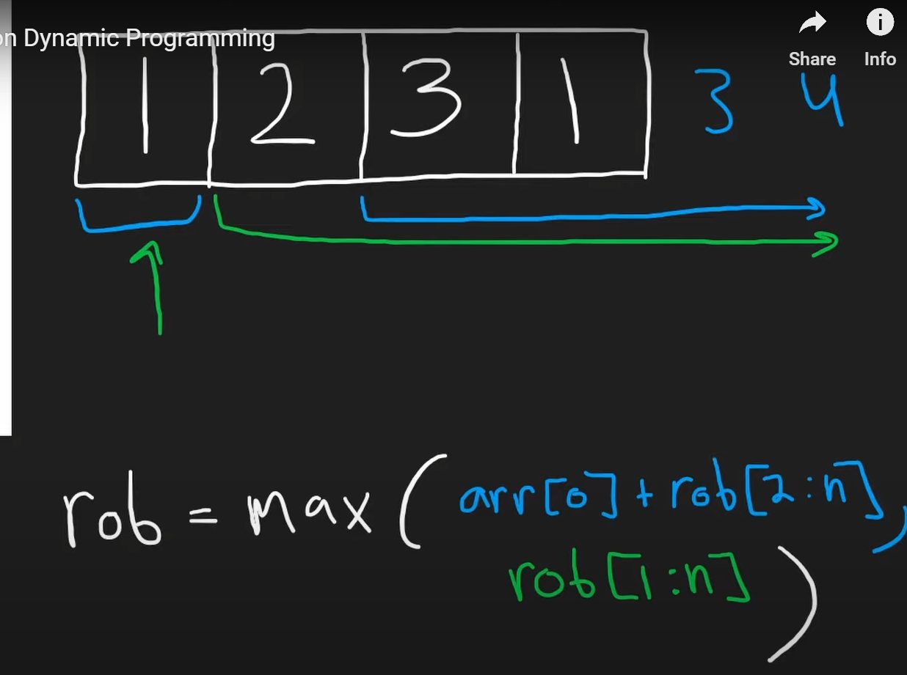
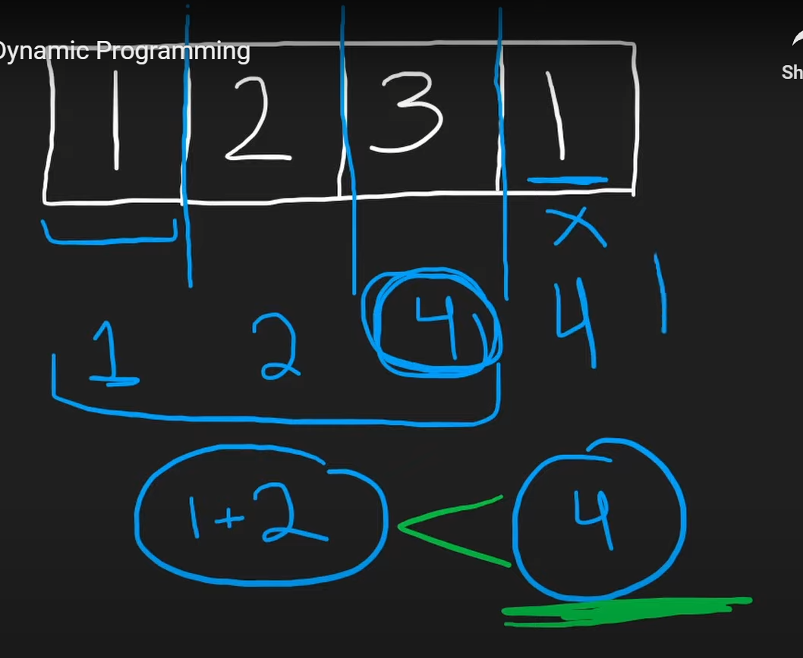
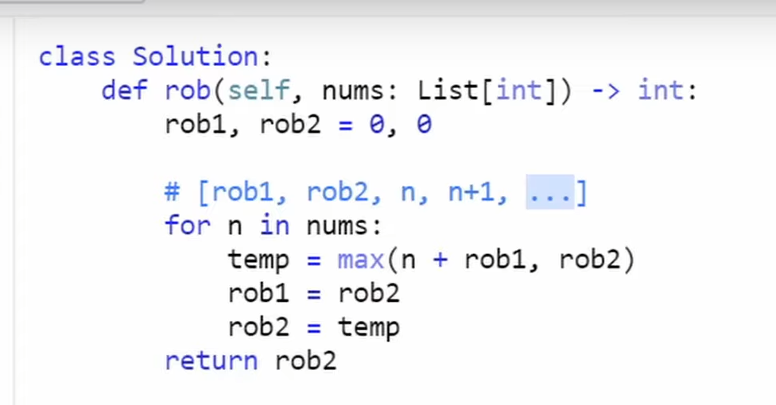

Calculate the max till that point, the sub problem is finding max till that point

for <!--StartFragment-->

\[1,2,3,1]

<!--EndFragment-->
first loop, temp =1,rob1=0,rob2=1
second loop, we reach at 2, temp=max(2+0,1)=2, rob1=1, rob2=2
now at 3, temp=max(3+1,2)=4, rob1 = 2, rob2 = 4
at 1, temp=max(1+2,4), rob2= 4

So rob2 = max_value till n-1, thats why we do not add n
rob1 = max_value till n-2, we can include n here