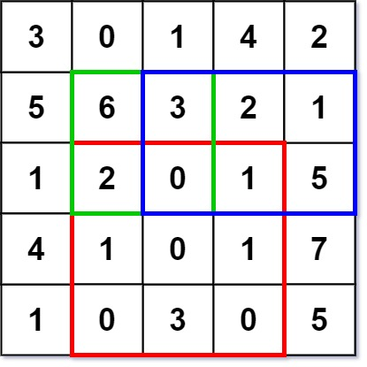
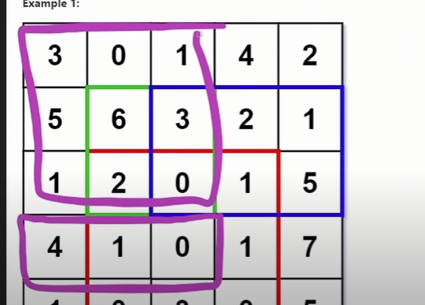
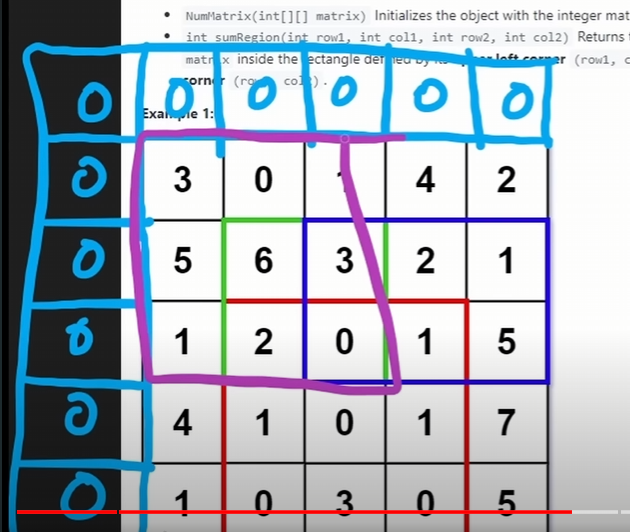
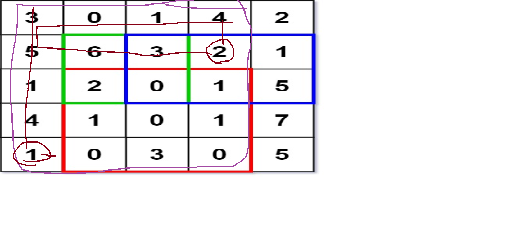

<!--StartFragment-->

[304. Range Sum Query 2D - Immutable](https://leetcode.com/problems/range-sum-query-2d-immutable/)

Medium

4.8K

335

Companies

Given a 2D matrix `matrix`, handle multiple queries of the following type:

*   Calculate the **sum** of the elements of `matrix` inside the rectangle defined by its **upper left corner** `(row1, col1)` and **lower right corner** `(row2, col2)`.

Implement the `NumMatrix` class:

*   `NumMatrix(int[][] matrix)` Initializes the object with the integer matrix `matrix`.
*   `int sumRegion(int row1, int col1, int row2, int col2)` Returns the **sum** of the elements of `matrix` inside the rectangle defined by its **upper left corner** `(row1, col1)` and **lower right corner** `(row2, col2)`.

You must design an algorithm where `sumRegion` works on `O(1)` time complexity.

<!--EndFragment-->

- https://youtu.be/KE8MQuwE2yA?si=lMJlhKY2hjGWvfBI

- Use prefix Sum
- For each row keep on adding it.
- Also add the `[row-1][col-1]`, that will give the sum of that box.

- Like in 3th row `[3,2]` (starting from 0), calculate prefix sum of that row i.e. 4+1+0, also add the value at ur sum matrix on position right above it, so it will give u the value of that entire box as highlighed by purple.
- Making sum_matrix 1x1 larger, to prevent out of bound error.

- My explaination of solution

- For the sum of `[2, 1, 4, 3]`
- position 3 at sum matrix will have the sum of entire brown box
- so that sum minus the value `sum_matrix[r1-1][c2] i.e.[2-1][2]`  at position 2 higliged in brown,  minus `sum_matrix[r2][col-1]` (deletes brow 1 highligehd) + `sum_matric[r1-1][c1-1]` at the position of 5, which is being delete twice, position 5 will hold sum of 5 and above it 3
