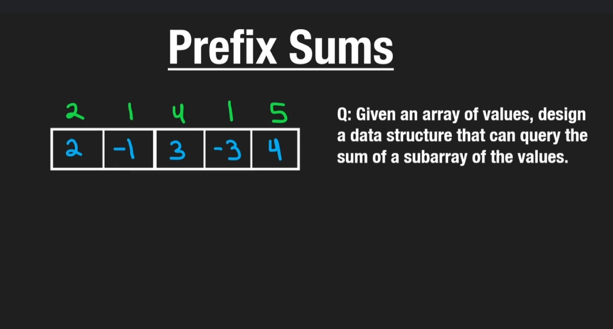
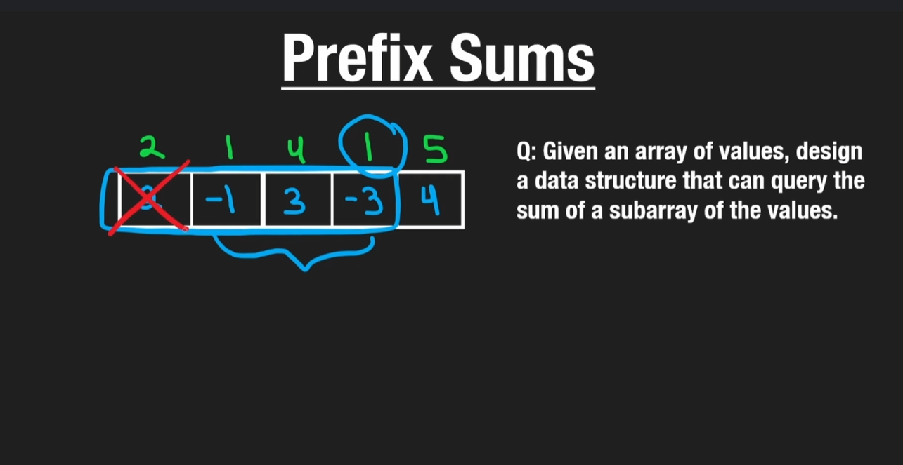

# Prefix Sums
- Basically u keep on adding prefix sum to current index value

- GIven the question, find sum of subarray L=1,R=3
- Naive way would be to loop in that subarray and get sum
- But if we have already precomputed sum at each position, we can get sum of R, and substract L-1 sum

# Leetcode Questioins relating to it
- https://leetcode.com/problems/range-sum-query-immutable/description/